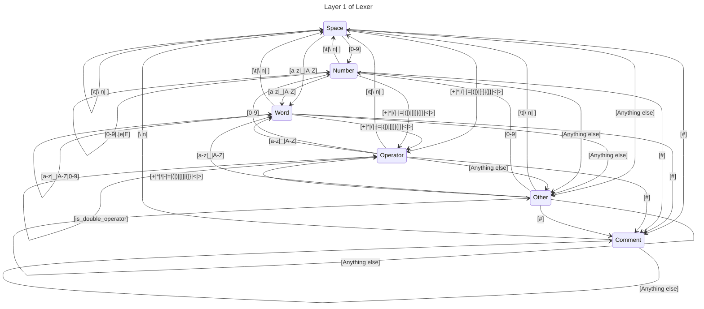

# Lexer

The lexer works in 2 layers. The first outlined with a state machine here builds an accumulator and passes that to the second layer. This second layer matches the accumulator to a variety of regexes that form the actual tokens.

To further expand the kinds of tokens like adding double operand operators, the logic within the first layer should be altered first to accumulate multiple operators.

~~Currently non alphanumeric characters are only accumulated as 1 character.~~

Now we support double character operators in a pretty trash way. It might eventually be a good idea to come back to this code and work on it. But I think it's more reasonable to work on the actual AST and LLVM frontend.