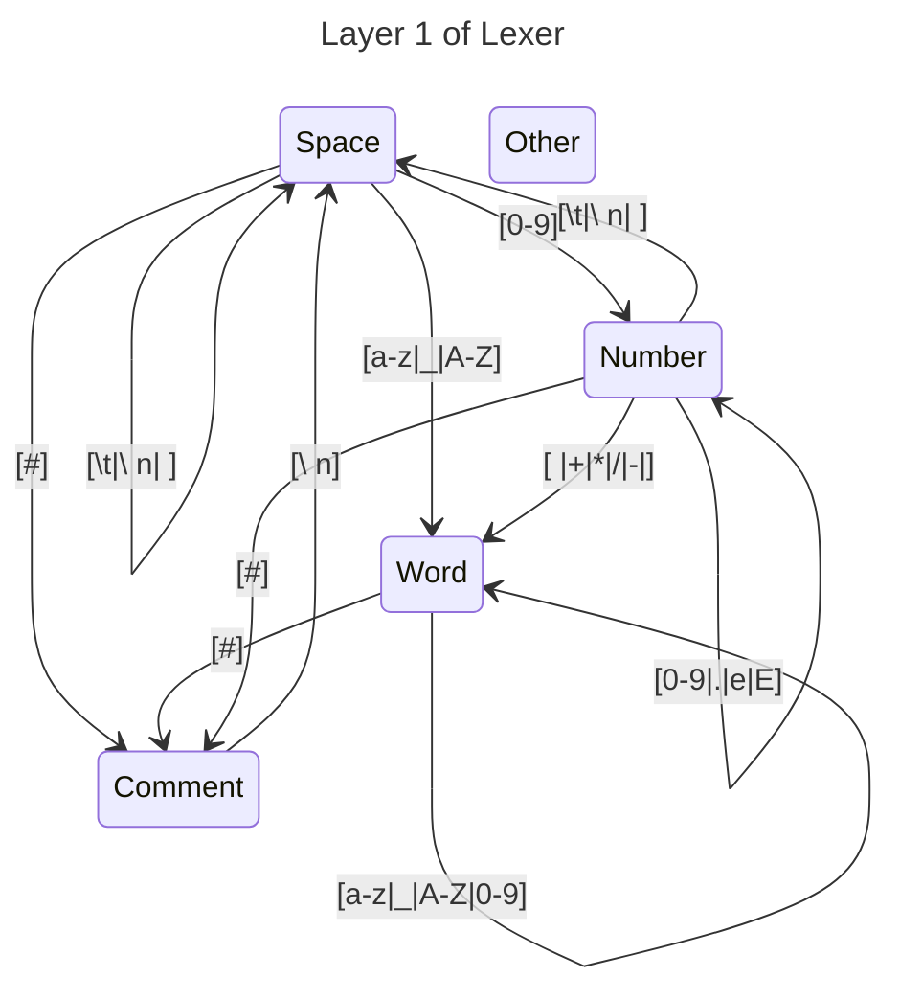

# Lexer

```mermaid
---
title: Layer 1 of Lexer
---
stateDiagram-v2

    Space
    Word
    Number
    Comment
    Other

    Space --> Space   : [\t|\ n| ]
    Space --> Number  : [0-9]
    Space --> Word    : [a-z|_|A-Z]
    Space --> Comment : [#]

    Word  --> Word    : [a-z|_|A-Z|0-9]
    Word  --> Comment : [#]

    Number --> Space  : [\t|\ n| ]
    Number --> Comment: [#]
    Number --> Word   : [ |+|*|/|-|]
    Number --> Number : [0-9|.|e|E]

    Comment --> Space : [\ n]

```